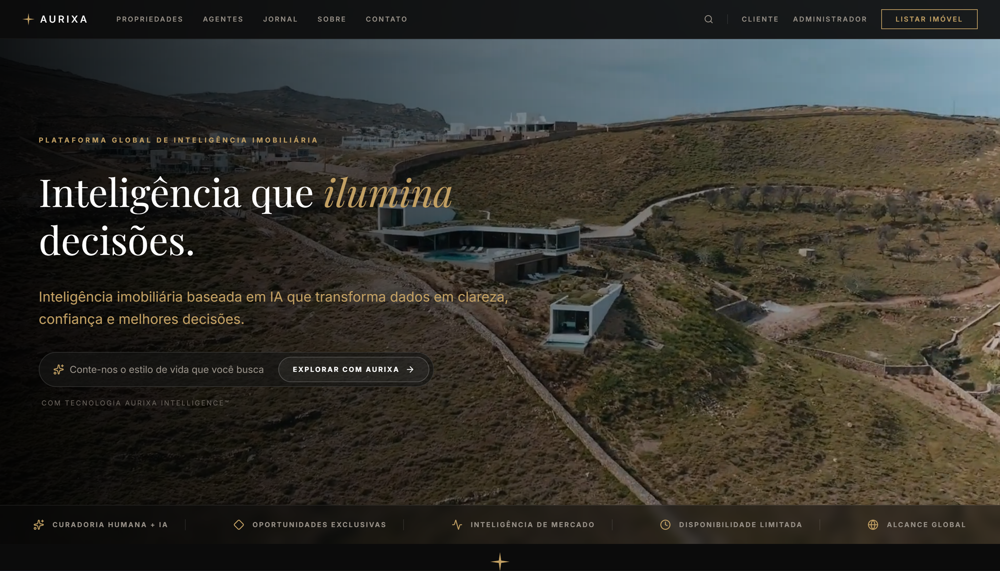
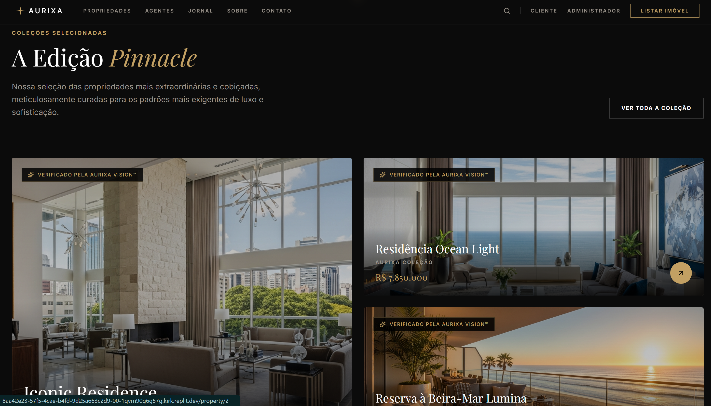
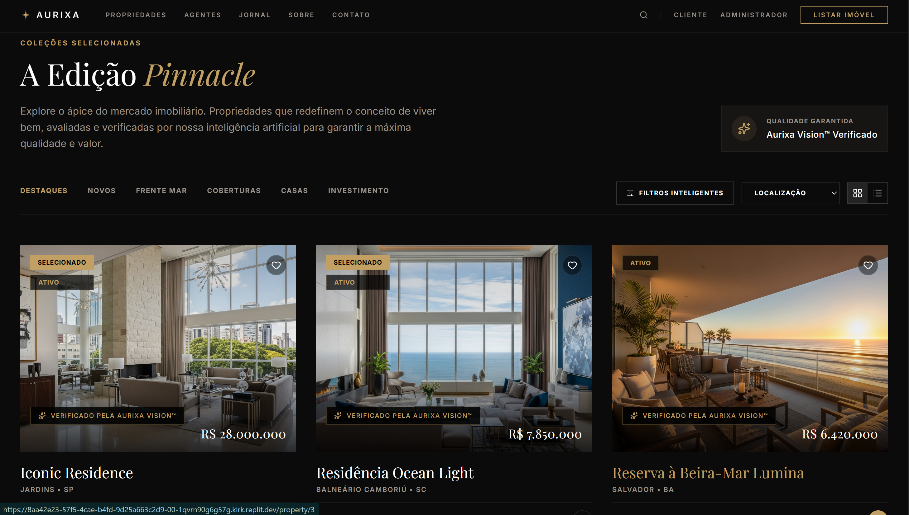
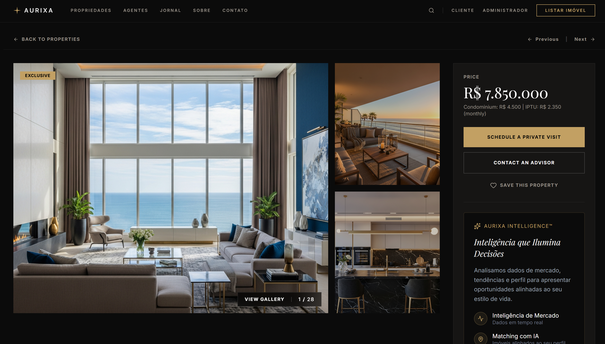
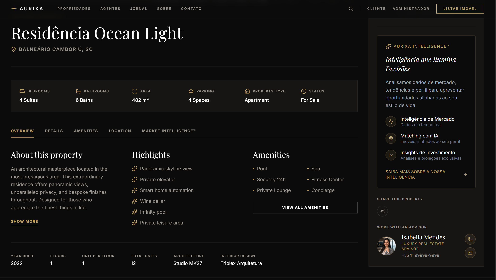

# AURIXA Platform

**A full-stack luxury real-estate platform for the Brazilian market — a cinematic React 19 frontend experience paired with a production-oriented Strapi v5 backend featuring an AI property-enrichment pipeline and automated lead handoff.**

> **Licence notice:** this repository is published for portfolio evaluation and technical review only — see [Licence](#licence).

---

## Live Demo

**Frontend showcase:** https://aurixa-pinnacle-edition-x.replit.app/

The live demo runs the frontend in this repository with local demo data.

## Product Overview

AURIXA is a premium real-estate intelligence platform concept targeting high-net-worth buyers and sellers in Brazil. This repository contains both halves of the platform, built as complementary pieces of work:

- **`frontend/`** — a cinema-grade React 19 single-page application: cross-fading 4K video hero, editorial "Pinnacle Collection" bento grids, a cinematic video gallery, filterable property discovery, and immersive property-detail pages. The public snapshot runs standalone on curated local demo data.
- **`backend/`** — a production-oriented Strapi v5 / PostgreSQL backend: property CMS with Cloudinary media, an AI enrichment pipeline (Restb.ai computer vision + OpenAI pt-BR copywriting), and a hardened public lead-inquiry endpoint with n8n/CRM handoff.

**Integration status, stated plainly:** the public frontend snapshot is not currently wired to the included backend — it ships with local mock data so the full experience runs anywhere with zero configuration. The backend implements the platform API layer the frontend is designed to consume; the connection is the intended integration boundary documented in [docs/architecture.md](docs/architecture.md).

## Business Problem

Luxury real estate demands presentation quality that generic portals cannot deliver, while agencies need operational leverage: consistent listing copy, structured media, and fast lead response. AURIXA addresses both sides — a brand-defining buyer experience on the front, and a backend that turns raw property photos into structured intelligence and polished listing copy, and turns anonymous visitors into routed, CRM-ready leads.

## Key User Experiences

- **Cinematic first impression** — full-screen cross-fading video hero with an AI-search input and brand strip.
- **Curated discovery** — filterable property listing with category tabs, grid/list toggle, and verification badges.
- **Cinematic gallery** — swipeable, buffered multi-video showcase with PiP and fullscreen support.
- **Immersive property detail** — galleries, spec sheets, advisor context, and inquiry entry points.
- **Client & admin portal concepts** — saved properties, schedules, messages, and an intelligence sidebar (demo data).

## Complete Platform Features

| Area | Frontend (showcase) | Backend (implemented) |
|---|---|---|
| Properties | Discovery, detail pages, Pinnacle collection | CMS collection type, REST API, draft & publish |
| Media | 4K video, poster images, galleries | Cloudinary storage via upload provider |
| AI | AI-search & intelligence branding (demo) | Restb.ai vision analysis + OpenAI pt-BR descriptions |
| Leads | Inquiry entry points | Public sanitised endpoint + n8n webhook handoff |
| Admin | Admin portal concept (demo data) | Strapi admin panel, role-based permissions |

## Frontend Engineering

- **React 19 + Vite 7 + TypeScript**, pnpm workspace with a supply-chain-hardened `minimumReleaseAge` policy.
- **wouter** routing, **TanStack Query** hooks, **Tailwind CSS 4** + shadcn/ui (Radix primitives), **framer-motion** motion system (Reveal, StaggerGroup, ParallaxImage).
- Custom cinematic video engine: per-slide `<video>` buffering, PiP-aware visibility handling, touch navigation.
- Local TypeScript mock data (`src/data/`) — 9 curated properties, advisor profiles, portal fixtures — so the showcase runs with no backend or secrets.

## Backend Engineering

- **Strapi v5.34 (Node.js ≥ 20, TypeScript)** headless CMS on **PostgreSQL** (SQLite supported locally).
- Content types: `Property` (title, price, images, `ai_metadata`, `ai_description`; draft & publish) and `Inquiry` (sanitised lead fields, property/routing/UTM metadata, forwarding status).
- Custom routes beyond the core REST API: admin-only AI enrichment and a public inquiry endpoint.
- Defensive integration design: every external call is guarded — missing keys skip features gracefully, failed AI responses abort without persisting, webhook failures are recorded per record.

## AI Property-Enrichment Pipeline

1. On property update (or on demand via `POST /api/properties/:id/ai-enrich`, admin-only), all property image URLs are sent to **Restb.ai** `multianalyze` (room types, features, captions, condition/quality signals `c1c6`/`q1q6`).
2. The structured result is stored as `ai_metadata`.
3. **OpenAI (gpt-4o)** generates a conservative, hallucination-averse Brazilian-Portuguese listing description (120–180 words) grounded strictly in the vision data, stored as `ai_description`.
4. Failure protection: non-OK responses and `error: true` bodies abort the pipeline — nothing is saved and OpenAI is never called on bad data.

## Architecture

Full details and Mermaid diagrams (platform architecture, frontend flows, AI enrichment, inquiry handoff): **[docs/architecture.md](docs/architecture.md)**

## Technology Stack

| Layer | Technology |
|---|---|
| Frontend | React 19, Vite 7, TypeScript, Tailwind CSS 4, shadcn/ui, framer-motion, TanStack Query, wouter (pnpm) |
| Backend | Strapi 5.34, Node.js ≥ 20, TypeScript (npm) |
| Database | PostgreSQL (SQLite for local experimentation) |
| Media | Cloudinary |
| Image AI | Restb.ai `multianalyze` |
| Text AI | OpenAI Chat Completions (gpt-4o) |
| Automation | n8n webhook (lead handoff) |

## Data and API Flow

- Frontend (public snapshot): local mock data → React Query hooks → UI.
- Backend: admin CMS → PostgreSQL/Cloudinary → AI enrichment → REST API; public inquiries → sanitisation → persistence → n8n forwarding.
- The platform API layer (`/api/properties`, `/api/inquiries`) is the designed integration boundary between the two — see **[docs/api.md](docs/api.md)**.

## Security Boundaries

- All backend credentials come exclusively from environment variables; nothing secret is committed.
- The n8n webhook URL never reaches the client; forwarding is server-side with a 10 s timeout.
- Public inquiry input is sanitised (control-character stripping, hard length caps) and email-validated before persistence.
- AI enrichment requires Strapi admin authentication; dev admin seeding is hard-gated to `NODE_ENV=development`.
- The frontend showcase requires no secrets at all.

## Project Structure

```
aurixa-platform/
├── README.md
├── LICENSE
├── .gitignore
├── frontend/          # React 19 SPA (pnpm)
│   ├── src/           # pages, components, motion system, mock data
│   ├── public/        # videos, favicon, robots.txt
│   └── .env.example
├── backend/           # Strapi v5 backend (npm)
│   ├── src/api/       # property + inquiry APIs, AI lifecycle
│   ├── config/        # server, database, plugins, middlewares
│   └── .env.example
└── docs/
    ├── architecture.md
    ├── api.md
    └── screenshots/
```

## Screenshots

### Cinematic Homepage — Hero

*Cross-fading 4K video hero with AI-search input and brand strip.*

### Homepage — Pinnacle Collection

*Editorial bento-grid layout for the curated Pinnacle selection.*

### Cinematic Gallery

*Buffered multi-video cinematic showcase with PiP and fullscreen.*

### Property Discovery

*Filterable listing with category tabs, grid/list toggle, and verification badges.*

### Property Detail

*Immersive property-detail experience with gallery and spec context.*

### Property Overview

*Structured property overview with pricing and feature highlights.*

## Local Development

### Frontend (pnpm)

```bash
cd frontend
pnpm install
pnpm dev          # dev server (default port 5173)
pnpm typecheck    # TypeScript validation
pnpm build        # production build
```

### Backend (npm)

```bash
cd backend
npm install
cp .env.example .env   # fill in your own values
npm run develop        # dev server + admin panel
npm run build && npm run start   # production
```

## Frontend Environment Variables

See [`frontend/.env.example`](frontend/.env.example) — the showcase needs no secrets:

- `PORT` — dev-server port (default 5173)
- `BASE_PATH` — URL path prefix (default `/`)

## Backend Environment Variables

See [`backend/.env.example`](backend/.env.example): Strapi security keys, PostgreSQL connection (or `DATABASE_URL`), Cloudinary credentials, and optional `RESTB_API_KEY`, `OPENAI_API_KEY`, `N8N_WEBHOOK_URL` — each optional feature degrades gracefully when unset.

## Verified Technical Highlights

- Frontend TypeScript typecheck: **passes**
- Frontend production build (Vite): **passes**
- Backend TypeScript validation (`tsc --noEmit`): **passes**
- Backend schema fully reproducible from tracked content-type definitions — no dumps or live data included
- Zero secrets in the repository — every credential is environment-driven

## Current Limitations

- The public frontend snapshot uses local demo data and does not call the included backend; wiring the two is the next integration milestone.
- Frontend authentication, dashboards, and AI search are presentation-layer showcases — not enforced or persisted in this snapshot.
- Backend AI enrichment runs synchronously in the update lifecycle (no queue/retry); failed webhook deliveries are recorded but not retried.
- No automated test suites yet; verification is via type checking and production builds.
- CRM (Pipedrive) integration and advanced automation are planned, not implemented.

## Author

**Aaron Archer**
AI-Native Full-Stack & Systems Engineer
https://digitalprodigy.dev

## Licence

Proprietary — © 2026 Aaron Archer. All rights reserved. Published solely for portfolio evaluation and technical review; no reuse rights granted. See [LICENSE](LICENSE).
