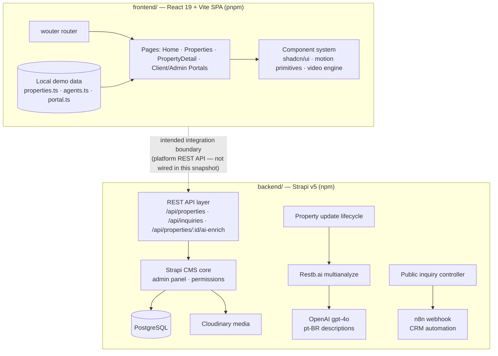
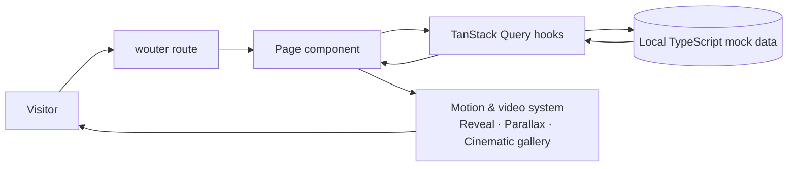
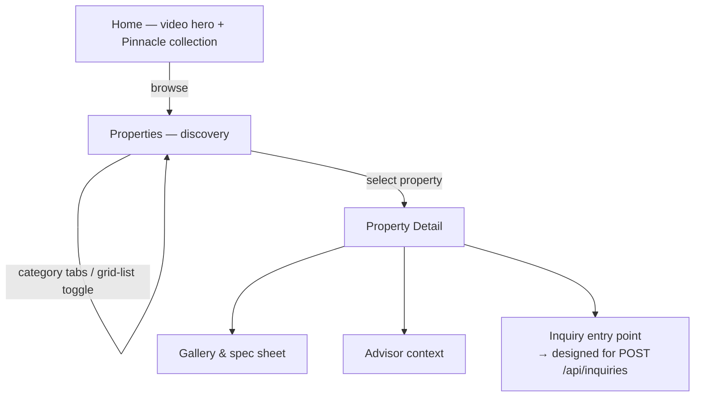
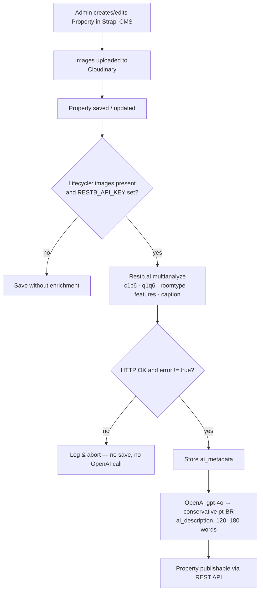

# AURIXA Platform — Architecture

This document combines the verified architecture of both halves of the platform: the React 19 frontend showcase (`frontend/`) and the Strapi v5 backend (`backend/`). The public frontend snapshot runs on local demo data; the backend implements the platform API layer the frontend is designed to consume. That connection is marked below as the **intended integration boundary** — it is not active in this snapshot.

---

## 1. Complete platform architecture



## 2. Frontend user and data flow



- **Stack:** React 19, Vite 7, TypeScript, Tailwind CSS 4, shadcn/ui (Radix), framer-motion, TanStack Query, wouter.
- **Data:** `src/data/` ships 9 curated properties, advisor profiles, and portal fixtures — no network calls, no secrets.
- **Video engine:** per-slide buffered `<video>` elements, PiP-aware visibility, touch navigation; large clips stream from a CDN, hero clips ship in `public/`.
- Portal pages (client/admin) are presentation-layer showcases on demo data — no authentication is enforced and nothing persists.

## 3. Frontend discovery-to-detail journey



## 4. Backend: property creation and AI enrichment



The same pipeline is available on demand via `POST /api/properties/:id/ai-enrich`, protected by the `admin::isAuthenticatedAdmin` policy.

## 5. Backend: public inquiry and n8n handoff

```mermaid
sequenceDiagram
  participant C as Client
  participant S as Strapi backend
  participant DB as PostgreSQL
  participant W as n8n webhook

  C->>S: POST /api/inquiries
  S->>S: sanitise + validate (name required; email or phone required)
  S->>DB: persist inquiry
  alt N8N_WEBHOOK_URL configured
    S->>W: forward structured payload (server-side, 10s timeout)
    W-->>S: 2xx / error
    S->>DB: status + forwarded_at / forward_error
  else not configured
    S->>DB: status = payload_ready_no_webhook_configured
  end
  S-->>C: { ok, id, status, mode }
```

## 6. Backend structure & data models

```
backend/
  config/                  # server, database, admin, api, middlewares, plugins
  src/
    index.ts               # bootstrap (dev-only admin seeding, NODE_ENV-gated)
    api/property/          # schema, lifecycle AI enrichment, core + ai-enrich routes
    api/inquiry/           # schema, sanitising controller, public route
```

**Property** (`draftAndPublish: true`): `title` (string, required, ≤255), `price` (decimal, required), `images` (media, multiple, Cloudinary), `ai_metadata` (json), `ai_description` (text).

**Inquiry**: `name`/`email`/`phone`/`message` (sanitised, length-capped), `property_ref` (json), `routing` (json), `metadata` (json: pagePath, locale, UTM), `status` (enum incl. `payload_ready_no_webhook_configured`), `forwarded_at`, `forward_error`.

Strapi derives every table from these content-type definitions at boot — the schema is fully reproducible from the repository; no dumps or live data are included.

## 7. Authentication & permissions

- Strapi admin panel: JWT (`ADMIN_JWT_SECRET`).
- `POST /api/properties/:id/ai-enrich`: `admin::isAuthenticatedAdmin` policy.
- `POST /api/inquiries`: deliberately public with server-side sanitisation.
- Core property REST access is governed by users-permissions role configuration.
- Frontend snapshot: no authentication is enforced (portal pages are showcases).

## 8. Security boundaries

- All backend credentials come exclusively from environment variables. One non-secret hardcoded fallback: relative image URLs resolve against `RENDER_EXTERNAL_URL`, falling back to a staging host when unset.
- The n8n webhook URL never reaches the client.
- Public input is control-character-stripped, trimmed, length-capped, and email-validated before persistence.
- Dev admin seeding runs only when `NODE_ENV=development`.
- The frontend requires no secrets whatsoever.

## 9. Deployment

- **Frontend:** static Vite build (`pnpm build`) deployable to any static host; the live demo runs on Replit.
- **Backend:** `npm run build` + `npm run start`, Render-compatible, PostgreSQL + environment-variable configuration.

## 10. Current limitations

- The frontend↔backend connection is a designed boundary, not an active integration, in this public snapshot.
- Frontend auth/dashboards/AI-search are presentation showcases (no enforcement, persistence, or live AI).
- Backend AI enrichment is synchronous in the lifecycle (no queue/retry); webhook failures are recorded, not retried.
- No automated test suites; verification is via typechecking and production builds.
- CRM (Pipedrive) integration and advanced n8n workflows are planned, not implemented.
