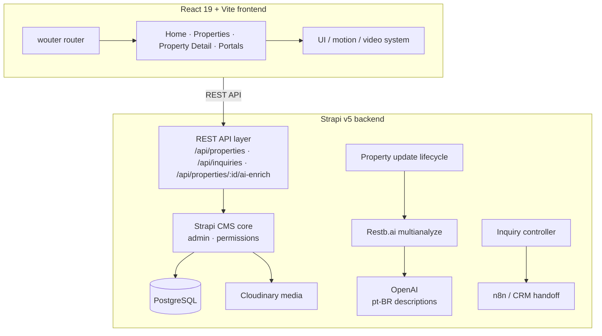
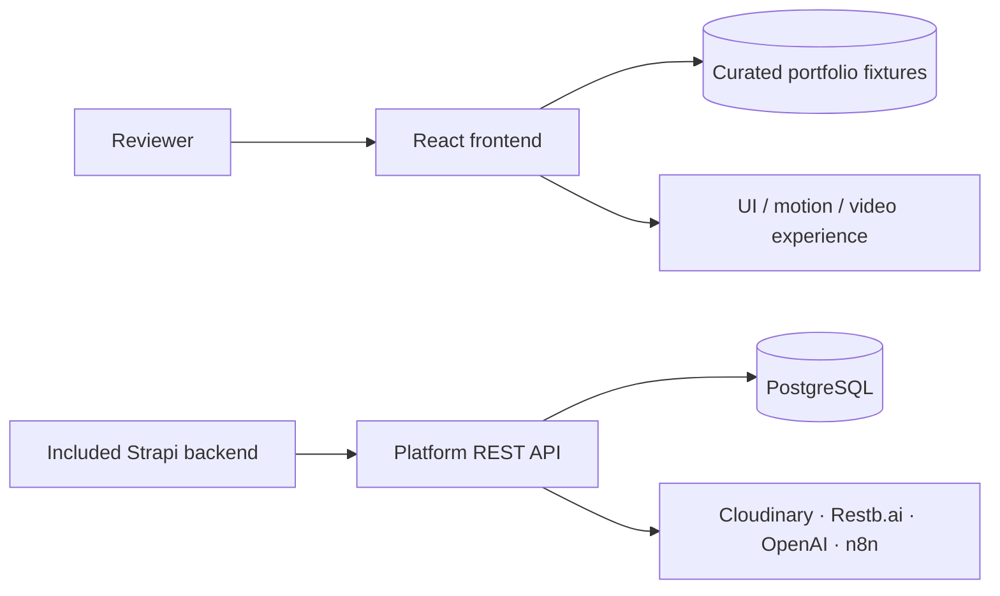
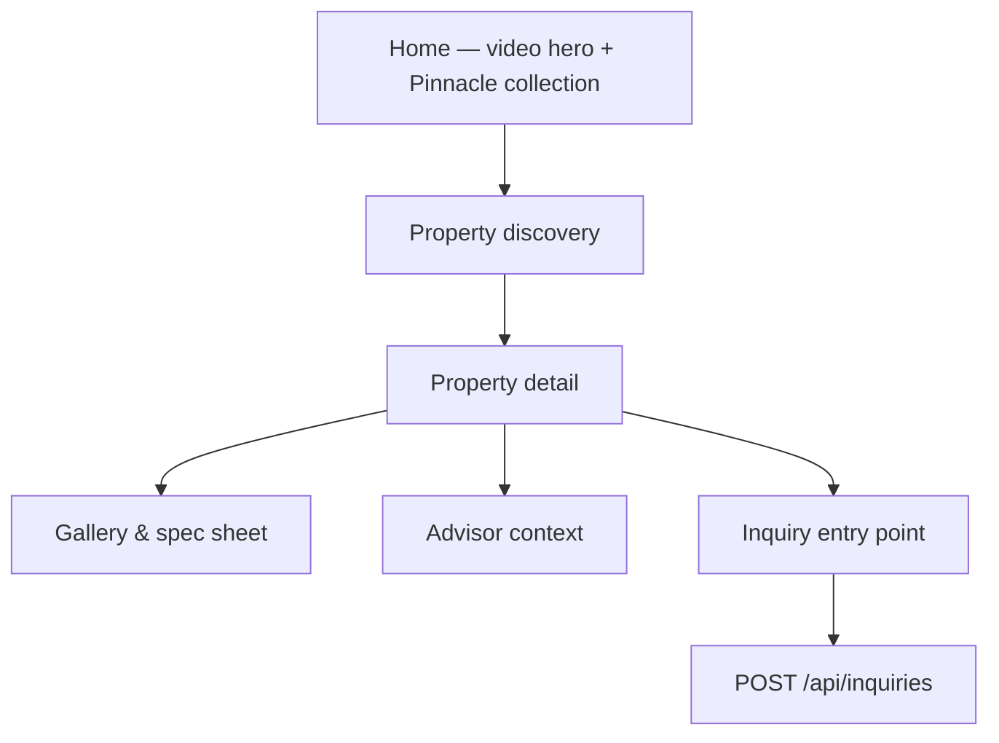
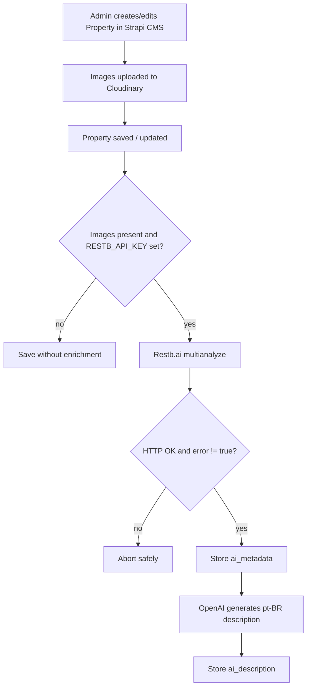
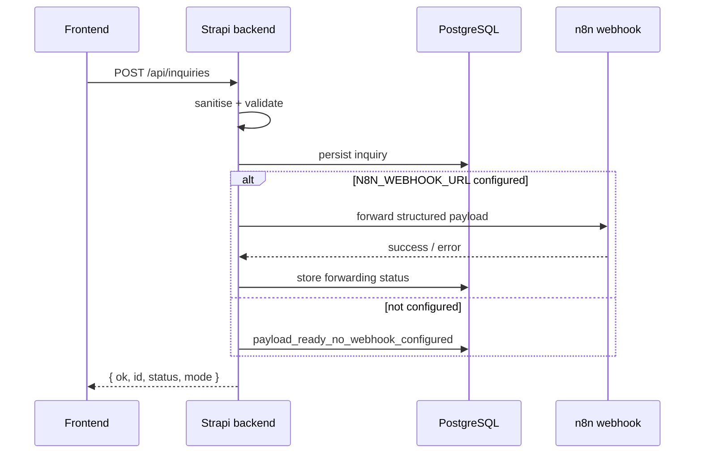

# AURIXA Platform — Architecture

AURIXA was delivered as a commissioned full-stack client platform combining a React 19 frontend with a Strapi v5 backend. In the client system, the frontend consumed the Strapi REST API for property and inquiry flows.

This public repository is a sanitized portfolio snapshot. It retains both halves of the platform and the integration boundary, but uses curated local frontend fixtures where needed so the showcase can run without private client data, production credentials or deployment-specific infrastructure.

---

## 1. Delivered system architecture



## 2. Public portfolio snapshot

The checked-in frontend contains local TypeScript fixtures under `frontend/src/data/` so the public demo can run independently of the private client environment.



This packaging decision should not be read as evidence that the commissioned frontend and backend were separate or unfinished. The client delivery used the API boundary shown in the first diagram; the public snapshot substitutes safe demo data for private production data and deployment configuration.

## 3. Frontend discovery-to-detail journey



## 4. Backend: property creation and AI enrichment



The same enrichment pipeline is available on demand via `POST /api/properties/:id/ai-enrich`, protected by Strapi admin authentication.

## 5. Backend: public inquiry and n8n handoff



## 6. Backend structure & data models

```text
backend/
  config/
  src/
    index.ts
    api/property/
    api/inquiry/
```

**Property**: title, price, images, `ai_metadata`, `ai_description`, draft/publish state.

**Inquiry**: sanitised contact fields, property context, routing metadata, UTM/page metadata, forwarding status, timestamps and errors.

The schema is reproducible from tracked Strapi content-type definitions; no production database dump is included.

## 7. Authentication & permissions

- Strapi admin panel uses authenticated admin access.
- `POST /api/properties/:id/ai-enrich` is admin-only.
- `POST /api/inquiries` is deliberately public and protected by server-side sanitisation / validation.
- Core property REST access is governed by Strapi users-permissions configuration.
- The public portfolio frontend does not ship client authentication state or private production sessions.

## 8. Security boundaries

- Credentials are environment-driven and are not committed.
- n8n webhook URLs remain server-side.
- Public inquiry input is sanitised, trimmed, length-capped and validated before persistence.
- AI enrichment is guarded by admin authentication.
- Public frontend fixtures prevent exposure of private client data.

## 9. Deployment model

- **Frontend:** Vite production build deployable to a static host.
- **Backend:** Strapi build/start process with PostgreSQL and environment-variable configuration.
- **Client delivery:** frontend and backend connected across the documented REST API boundary.
- **Portfolio snapshot:** frontend can run safely from curated fixtures while backend code and API contracts remain reviewable.

## 10. Public snapshot boundaries

- This repository represents a commissioned, integrated client system in sanitized portfolio form.
- Curated local fixtures are retained in the public frontend for reproducibility and privacy.
- Private production data, credentials, authentication state and deployment-specific configuration are intentionally excluded.
- Backend AI enrichment is synchronous and webhook failures are recorded rather than automatically retried.
- Verification in this snapshot is primarily via type checking and production builds rather than a committed automated test suite.
